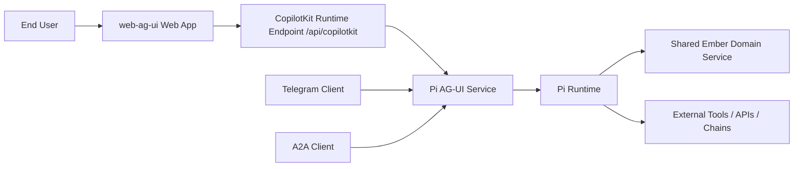
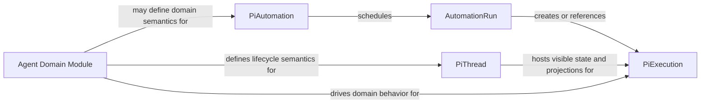
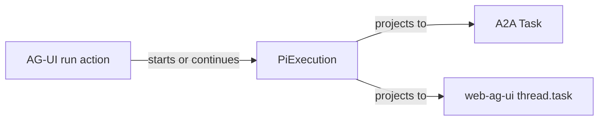
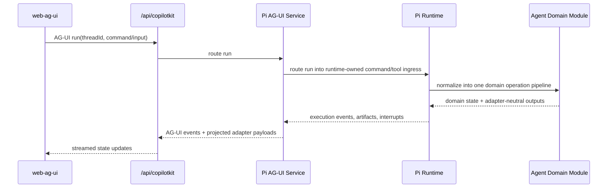
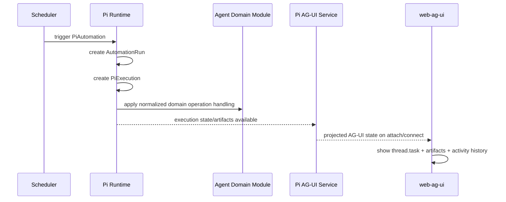
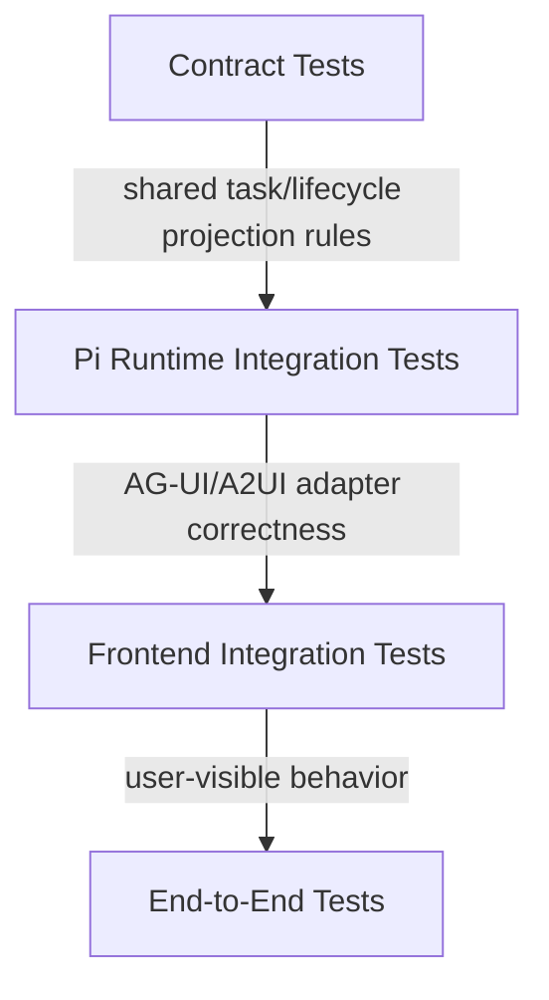

# C4 Target Architecture: Pi Runtime + AG-UI + Automations

Status: Draft (planning)
Scope: `typescript/clients/web-ag-ui`, Pi-backed agent runtime integration, and future A2A alignment

## 1. Why this document exists

The Pi-backed agent introduces a second runtime family into `web-ag-ui`. We need hard boundaries for:

- AG-UI versus Pi runtime responsibilities
- thread state versus execution state versus automation state
- durable domain records versus protocol/UI projections
- future A2A Task alignment without creating duplicate execution identity

This document complements the existing AG-UI-only target architecture and makes the Pi-specific execution model explicit.

It must also stay grounded on the actual `pi-mono` package seams:

- `@mariozechner/pi-agent-core`
  - foundational stateful agent loop, tool execution, event streaming, prompt/continue semantics
- `@mariozechner/pi-ai`
  - provider/model/tool-calling substrate beneath the agent loop
- `@mariozechner/pi-web-ui`
  - reference Pi UI package, but not the frontend/runtime boundary for this initiative because `web-ag-ui` stays AG-UI-only
- `@mariozechner/pi-coding-agent` and `@mariozechner/pi-mom`
  - reference integrations built on the Pi core packages, not the direct package foundation for the `web-ag-ui` architecture

Related docs:

- `docs/c4-target-architecture-web-ag-ui-agents.md`
- `docs/ag-ui-client-runtime-invariants.md`
- `docs/ag-ui-frontend-backend-contract-ui-stability.md`
- `docs/adr/0003-threadstate-uistate-lifecycle-phase-render-contract.md`
- `docs/adr/0005-pi-runtime-as-standalone-ag-ui-service.md`
- `docs/adr/0006-pi-thread-execution-automation-runtime-model.md`
- `docs/adr/0007-sibling-channel-adapters-and-canonical-thread-identity.md`
- `docs/adr/0008-runtime-agnostic-shared-contract-extraction.md`
- `docs/adr/0011-blessed-agent-runtime-factory-and-runtime-owned-projection-assembly.md`
- `docs/adr/0014-fail-closed-service-identity-preflight-for-managed-shared-ember-agents.md`

## 2. Boundary rules

1. AG-UI remains the only web-to-runtime protocol boundary.
2. The Pi-backed runtime in this initiative is built on `@mariozechner/pi-agent-core` and `@mariozechner/pi-ai`, not on an abstract replacement platform.
3. Pi is the gateway-style runtime-of-record for Pi-backed agents.
4. `PiExecution` is the canonical execution-loop record.
5. A2A `Task` and `web-ag-ui` `thread.task` are projections of `PiExecution`.
6. AG-UI `run` is a transport/control-plane action, not a durable business record.
7. `PiAutomation` is a saved recurring definition, and `AutomationRun` is an automation firing record, not the execution loop itself.
8. Agent-family lifecycle flows live in pluggable Pi-owned domain modules above the core runtime model, not in the AG-UI adapter and not in the foundational execution model itself.
9. Pi must expose a formal projection subsystem from canonical runtime records to AG-UI, A2A, and future channel views.
10. Model-facing automation tools and operator/runtime control surfaces are separate architectural planes.
11. Runtime maintenance, retention, and archival policy are first-class concerns.
12. `@mariozechner/pi-web-ui` is not the adopted frontend boundary for this initiative.
13. The web boundary follows ADR 0003 strictly:
   - Pi emits domain `ThreadState`
   - web derives `UiState`
   - React views consume only `UiState`
14. React/view code must contain zero agent business logic and zero agent-side invariant enforcement.
15. Client-side invariants are limited to projection/view-model concerns such as authority selection, stale-event rejection, ordering guards, and local transient UI state.
16. Reusable Pi AG-UI HTTP adapter logic belongs in the `agent-runtime` package family, not in bespoke per-agent app code.
17. Any Pi-capable `HttpAgent` transport helper required to consume the Pi AG-UI surface also belongs in the `agent-runtime` package family, not in `apps/web`.
18. Concrete Pi-backed agent apps should primarily assemble agent/domain behavior and runtime configuration; they should not re-implement generic AG-UI route parsing, SSE framing, or HTTP request adaptation.
19. The CopilotKit route may instantiate runtime-owned transport helpers, but it must remain protocol routing only and must not own Pi-specific transport behavior.

## 3. System context



Key point:

- Web, Telegram, and A2A are sibling client surfaces around the same Pi gateway runtime.
- The gateway runtime itself is an initiative-specific layer built around `@mariozechner/pi-agent-core` + `@mariozechner/pi-ai`, not a claim that all of the durable records in this document already exist as `pi-mono` primitives today.
- The current concrete managed downstream pair is `agent-portfolio-manager` plus `agent-ember-lending`; both are separate Pi-backed runtimes that consume Shared Ember over thin app-local adapters instead of talking to each other directly.

## 4. Container view

```mermaid
flowchart TB
  subgraph Browser[Browser / web-ag-ui]
    UI[React / Next UI View]
    Store[UiState Projection Store]
    Stream[AG-UI Stream + Command Layer]
  end

  subgraph WebServer[Next.js Web App]
    CK[CopilotKit Route]
  end

  subgraph PiService[Pi AG-UI Service]
    Adapter[AG-UI Adapter]
    A2UI[A2UI Payload Emitter]
  end

  subgraph PiRuntime[Pi Runtime]
    AgentCore[@mariozechner/pi-agent-core]
    PiAI[@mariozechner/pi-ai]
    Projection[Projection Layer]
    Domain[Agent Domain Module]
    Threads[PiThread Store]
    Execs[PiExecution Store]
    Autos[PiAutomation Store]
    Runs[AutomationRun Store]
    Scheduler[Automation Scheduler]
    Ops[Operator Control Plane]
  end

  SE[Shared Ember Domain Service]

  UI --> Store
  Store --> Stream
  Stream --> CK
  CK --> Adapter
  Adapter --> A2UI
  Adapter --> AgentCore
  AgentCore --> PiAI
  Adapter --> Projection
  Projection --> Domain
  Domain --> Threads
  Domain --> Execs
  Domain --> Autos
  Domain --> Runs
  Projection --> Threads
  Projection --> Execs
  Domain --> SE
  Scheduler --> Autos
  Scheduler --> Runs
  Scheduler --> Execs
  Ops --> Threads
  Ops --> Execs
  Ops --> Autos
  Ops --> Runs
```

Container responsibilities:

- `web-ag-ui` view layer: render-only, consumes `UiState` only
- `web-ag-ui` projection layer: derives `UiState` from AG-UI `ThreadState` payloads plus local transient UI state
- CopilotKit route: protocol routing only and runtime registration; it does not own Pi-specific transport behavior
- Pi AG-UI service: adapter boundary from Pi runtime to AG-UI/A2UI, owned by the shared `agent-runtime` package family rather than reimplemented per agent app
- `@mariozechner/pi-agent-core`: foundational in-turn agent loop, tool execution, and emitted event stream
- `@mariozechner/pi-ai`: provider/model/tool-calling substrate beneath the Pi agent core
- Pi runtime core: canonical ownership of threads, executions, automations, and automation runs
- Projection layer: maps canonical Pi records into AG-UI, A2A, and future channel-specific views without creating competing durable identities
- Agent domain module: pluggable layer for agent-family-specific lifecycle, interrupt, command, and semantic A2UI content
- Operator control plane: scheduler health, maintenance, replay/recreate, inspection, and archival workflows that are not model-facing tools
- Current managed-runtime example:
  - `agent-portfolio-manager` owns onboarding approval, rooted-signing collection, and managed-agent control-plane projection, but Shared Ember owns the durable reservation and owned-unit truth created during onboarding completion.
  - `agent-portfolio-manager` startup must resolve the local OWS controller wallet, confirm or rewrite the durable `portfolio-manager` / `orchestrator` identity with an identity-scoped idempotency key, and fail closed unless Shared Ember echoes the confirmed identity with the expected `agent_id`, `role`, and wallet address.
  - `agent-portfolio-manager` does not mark managed onboarding complete until a follow-up `subagent.readExecutionContext.v1` read for `ember-lending` exposes a non-null `subagent_wallet_address`.
  - `agent-portfolio-manager` wallet-accounting reads must target the activated managed mandate lane, not the portfolio-manager lane, so reservation and policy-snapshot context comes from the same agent scope that Shared Ember activated during bootstrap.
  - The current portfolio-manager implementation writes `activation.mandateRef` on new bootstrap completions but still tolerates legacy stored bootstrap payloads that only captured `activation.agentId` until older thread state is replaced.
  - `agent-ember-lending` owns the bounded subagent read/plan/execute/escalate runtime against Shared Ember and consumes agent-scoped lane data plus rooted-wallet-wide wallet contents from Shared Ember execution context.
  - `agent-ember-lending` startup must resolve the local OWS signer wallet, confirm or rewrite the durable `ember-lending` / `subagent` identity with an identity-scoped idempotency key, and fail closed unless Shared Ember echoes the confirmed identity with the expected `agent_id`, `role`, and wallet address.
  - After healthy identity preflight plus onboarding, the first healthy `subagent.readExecutionContext.v1` read is expected to expose a non-null `subagent_wallet_address`.
  - The repo-local validation lane for this boundary is `pnpm smoke:managed-identities`; deeper OWS-internals refactors remain out of scope for this contract.

Important web constraint:

- web projection code may defend against stale/out-of-order transport behavior
- web must not enforce agent business rules or become the source of domain truth

### 4.1 Package Ownership Clarification

- The `agent-runtime` package family owns the reusable Pi AG-UI transport layer on both sides of the HTTP boundary:
  - runtime-side AG-UI mounting on the returned runtime service
  - root-level runtime-owned AG-UI HTTP client creation for web-side consumers
- Concrete Pi-backed `apps/agent*` own:
  - domain-specific agent construction
  - runtime configuration
  - process/bootstrap wiring that is specific to that app
- `apps/web` owns:
  - runtime registration and endpoint configuration
  - protocol-level routing through CopilotKit
  - no Pi-specific transport implementation beyond consuming runtime-owned helpers

## 5. Domain model



Definitions:

- `PiThread`
  - durable user-facing conversation/session container
- `PiExecution`
  - canonical execution-loop record for agent work
- `PiAutomation`
  - saved recurring/triggered automation definition
- `AutomationRun`
  - one firing/audit record of an automation
- `Agent Domain Module`
  - pluggable Pi-owned layer for agent-family-specific lifecycle, commands, interrupts, dynamic system context, and adapter-neutral domain outputs

Examples:

- DeFi agents may use domain modules with lifecycle terms such as hire/setup/sync/fire.
- Other agent types may define different lifecycle vocabularies without changing the core runtime model.

### Domain-Module SPI

Every Pi-owned domain module should define one explicit SPI surface:

- lifecycle declaration:
  - domain phases, commands, transitions, and interrupts
- dynamic system context:
  - domain-aware context appended to the system prompt path
- normalized operation handling:
  - one domain-facing operation handler that is agnostic to whether the request came from the direct command lane or the LLM tool lane
- domain outputs:
  - adapter-neutral outputs such as artifacts, interrupts, and status-bearing domain results
- automation policy hooks:
  - domain-specific decisions about whether automation may enqueue or resume work
- runtime boundary:
  - an explicit statement of what the domain module owns versus what remains in the core Pi runtime

For the first DeFi lifecycle module, the boundary is:

| Owned by DeFi domain module | Owned by core Pi runtime |
| --- | --- |
| `hire/setup/sync/fire` command vocabulary | `PiThread`, `PiExecution`, `PiAutomation`, `AutomationRun` |
| DeFi lifecycle phases and transitions | durable persistence and restart boundaries |
| DeFi-specific interrupt schemas and policy | interrupt delivery and resurfacing plumbing |
| dynamic system context and adapter-neutral domain outputs | canonical execution identity and protocol projections |
| sync automation policy decisions | scheduler, outbox/dedupe, and operator control-plane infrastructure |

## 6. Projection model



Important non-equivalence:

- `AG-UI run` is not the same thing as `AutomationRun`
- `A2A Task` is not a second durable entity beside `PiExecution`
- `thread.task` is not its own durable execution system

They all converge on `PiExecution`.

Identity rules:

- `PiThread.id` is the canonical root-thread identity.
- `PiExecution.id` is the canonical execution identity.
- `PiAutomation.id` is the canonical saved automation identity.
- `AutomationRun.id` is the canonical automation-firing identity.
- AG-UI thread/task ids, A2A task/context ids, and future channel execution ids must map back to those records explicitly.

Important layering rule:

- Domain lifecycle vocabularies do not redefine the foundational execution model.
- They extend it through the agent domain module layer.

## 7. Direct-chat execution sequence



## 8. Automation-triggered execution sequence



## 9. Automation inspection/control boundary

The model-facing automation surface should stay narrow.

Preferred shape:

- `automation.schedule`
- `automation.list`
- `automation.cancel`

Do not expose scheduler-control sprawl to the model by default:

- raw delivery routing
- channel/webhook fanout
- failure-alert tuning
- internal wake/scheduler knobs
- low-level persistence/debug fields

Those remain runtime/operator concerns unless proven necessary.

## 10. Operator/runtime control plane

Examples that belong here rather than in model-facing tools:

- scheduler health and lease inspection
- replay/recreate controls for interrupted executions
- outbox/dedupe inspection
- retention/archival and maintenance workflows
- low-level debug views for execution and automation history

## 11. Testing boundaries



What each layer should prove:

- Contract tests:
  - `PiExecution -> Task` projection semantics
  - lifecycle/task-state invariants
  - domain-module contract invariants
- Pi runtime integration:
  - thread/execution/automation persistence
  - automation firing creates `AutomationRun` + `PiExecution`
  - interrupt surfacing and dedupe behavior
  - projection-layer id mapping correctness
  - operator/runtime control plane reads canonical runtime state rather than transport logs
  - domain-module lifecycle/projection behavior
- Frontend integration:
  - `thread.task` projection correctness
  - A2UI artifact rendering and state updates
  - `ThreadState -> UiState -> View` layering stays intact
  - no agent business rules are enforced in React/view code
- End-to-end:
  - direct chat execution
  - automation-triggered execution
  - restart/recovery behavior

## 12. Open design area

Still unresolved:

- the exact automation inspection/control tool API shape for interactive chat turns

Everything else in this document should be treated as the current target boundary model.
