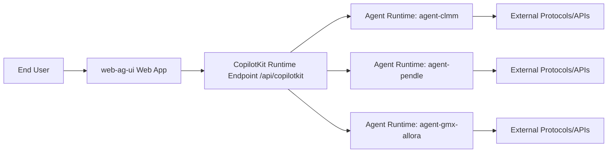
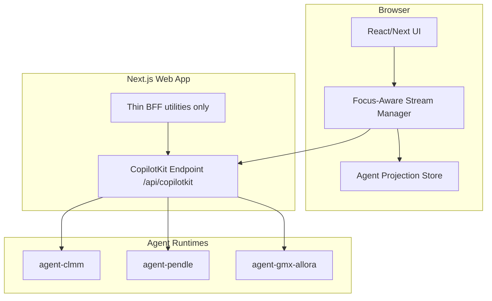
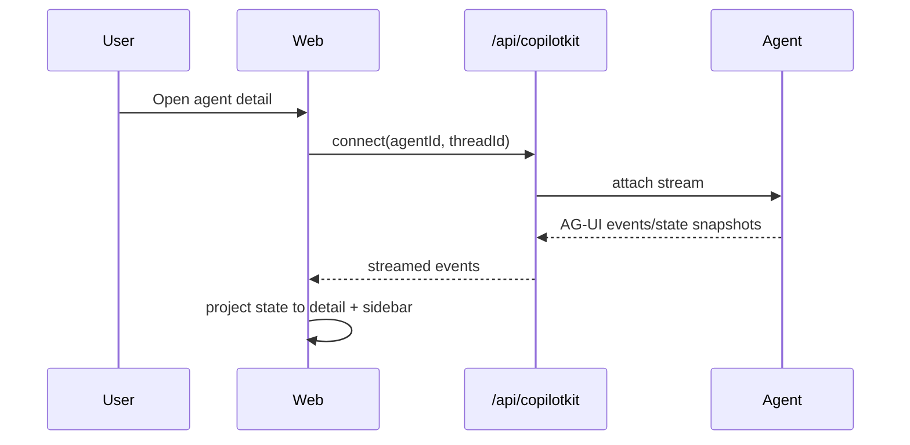
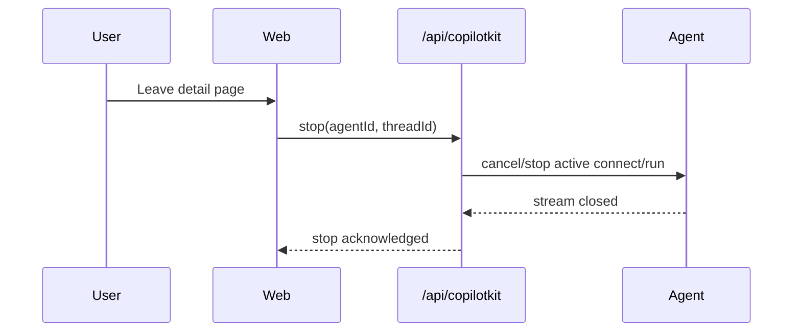
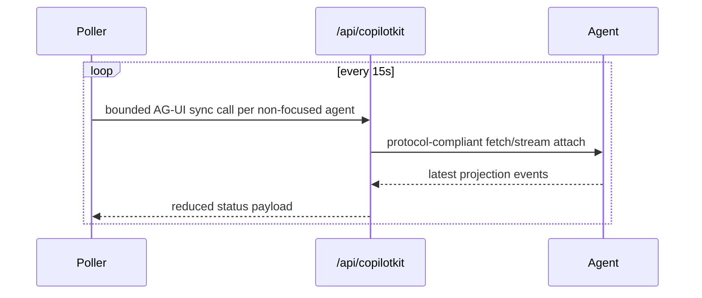

# C4 Target Architecture: web-ag-ui + Agents (AG-UI-Only)

Status: Draft (target vision)
Scope: `typescript/clients/web-ag-ui/apps/web` and `typescript/clients/web-ag-ui/apps/agent*`

## 1. Why this document exists

This C4 document describes the target architecture we want to converge to from the current implementation:

- Web must communicate with agents only through AG-UI semantics (`connect`, `run`, `stop`) via CopilotKit runtime.
- Web must not read or mutate LangGraph thread state directly (`/threads/*`).
- Agent state lifecycle and onboarding/task transitions should be consistent across all agent apps.

Current code references that motivate this:

- `apps/web/src/hooks/useAgentConnection.ts` (focused detail stream + AG-UI command bus)
- `apps/web/src/contexts/AgentListContext.tsx` (sidebar polling cadence and fan-out behavior)
- `apps/agent-workflow-core/src/taskLifecycle.ts` (shared command and task lifecycle helpers)
- `patches/@ag-ui__langgraph@0.0.20.patch` (custom connect behavior)

## 2. Architectural principles (target)

1. AG-UI is the only web-to-agent protocol boundary.
2. One long-lived stream per focused detail page; no hidden background persistent streams.
3. List/status updates are bounded polling and protocol-compliant.
4. All agents publish one versioned `ThreadView` contract.
5. Agent command and task transitions are governed by a shared state machine library, not per-agent drift.
6. No dual sources of truth for UI state (stream projection is primary).

## 3. C4 Level 1: System Context

Boundary intent:

- User-facing web talks only to CopilotKit runtime over AG-UI-compatible routes.
- Runtime talks to agent runtimes; web never talks directly to LangGraph thread APIs.

## 4. C4 Level 2: Container View

Container responsibilities:

- UI: rendering only; no LangGraph thread semantics.
- Stream Manager: owns connect/run/stop lifecycle and focus rules.
- Projection Store: derives sidebar/detail state from AG-UI events.
- CopilotKit endpoint: protocol boundary and routing to agents.
- Agent runtimes: workflow execution and state emission.

Explicit non-goal container:

- No `/api/agents/sync` container in target architecture.

## 5. C4 Level 3: Component View

### 5.1 Web components

- `AgentStreamCoordinator` (new):
  - Ensures only the focused agent keeps a long-lived `connect` stream.
  - On route blur/unmount, calls protocol stop/cleanup immediately.
  - Enforces a hard cap of active streams (target: `<= 1` long-lived detail stream).

- `AgentStatusPoller` (refactored list polling):
  - Every 15s, performs short-lived AG-UI status sync for non-focused agents.
  - Uses protocol-compliant calls only; no direct thread endpoints.
  - Writes normalized status to shared projection store.

- `AgentProjectionReducer`:
  - Single reducer from AG-UI events to `ThreadViewProjection` for both sidebar and detail.
  - Removes split-brain between stream state and sync endpoint state.

- `AgentCommandBus`:
  - Sends `hire`, `sync`, `fire`, interrupt responses via AG-UI `run` payloads only.
  - No out-of-band command mutation.

- `AgentMetricsRendererRegistry` (new):
  - Resolves a per-agent metrics renderer by `agentId` (e.g., CLMM, GMX Allora, Pendle).
  - Keeps shared frame chrome (tabs/cards/loading/error) in one place.
  - Moves agent-specific metric visuals and derived calculations into isolated components.
  - Prevents a single “god” detail component from owning all agent-specific branches.

### 5.2 Runtime/server components

- `CopilotKit Runtime Route` (`/api/copilotkit`):
  - The only server route used by web for agent communication.
  - Exposes `connect`, `run`, and `stop` semantics.

- `Agent Registry`:
  - Maps agent ids to runtime endpoints and capabilities.
  - Provides metadata only; does not mirror thread state.

### 5.3 Agent runtime components (shared pattern)

Each `apps/agent*` uses a standard graph shape:

- Command ingestion node (`runCommand`)
- Onboarding/bootstrapping nodes
- Cycle/poll nodes
- Summary/terminal node
- `view` + `task` projection emission

Target factorization:

- `@web-ag-ui/agent-workflow-core` (new shared internal package):
  - Canonical command parsing
  - Canonical onboarding + task state machine
  - Shared `ThreadView` schema + versioning
  - Shared event/status helpers

## 6. Dynamic views (sequence)

### 6.1 Detail page open (focused stream)

### 6.2 Navigate away from detail

### 6.3 Sidebar refresh (non-focused agents)

## 7. Data contracts

### 7.1 Canonical contracts (target)

- `ThreadView@vN` (versioned): profile, metrics, activity, task, interrupts, onboarding.
- `TaskState` enum (shared): `submitted`, `working`, `input-required`, `completed`, `failed`, `canceled`.
- `AgentCommand` enum (shared): `hire`, `sync`, `fire`, plus typed interrupt resolutions.

### 7.2 Rules

- Backing thread state is internal to agent runtime.
- UI projections are derived from AG-UI events, not direct thread reads.
- Unknown contract version must fail safe with explicit telemetry.

## 8. Operational invariants

1. Long-lived detail streams: maximum 1 per browser session focus context.
2. Sidebar polling cadence: default 15s, bounded concurrency.
3. No direct web calls to `/threads`, `/runs`, or `/state`.
4. Every run has one terminal state event.
5. On page blur/unmount, stream teardown is deterministic.

## 9. Migration plan (from current state)

### Slice 1: Protocol boundary cleanup

- Remove `apps/web/src/app/api/agents/sync/route.ts` and consumers.
- Replace `useAgentConnection` sync fallback with AG-UI-only projection path.
- Keep behavior parity via tests before deletion.

### Slice 2: Focus-aware stream governance

- Introduce `AgentStreamCoordinator`.
- Enforce stream ownership and deterministic stop on navigation.
- Add instrumentation for active stream count.

### Slice 3: Sidebar projection refactor

- Replace `AgentListContext` direct sync with bounded AG-UI status polling.
- Share reducer/state model between sidebar and detail.

### Slice 4: Metrics UI decomposition

- Introduce `AgentMetricsRendererRegistry` and per-agent metrics components.
- Keep `AgentDetailPage` as composition shell only (routing/layout), not a multi-agent logic hub.
- Move per-agent metric transforms into typed selectors adjacent to each renderer.

### Slice 5: Agent shared kernel

- Extract shared command/state/task logic from `apps/agent*` into internal package.
- Align all agents to one task lifecycle and onboarding contract.

### Slice 6: Patch retirement

- Minimize and retire local patches where upstream behavior is sufficient.
- Keep only patches that are protocol-correct and covered by tests.
- Exception: keep `@ag-ui/langgraph` connect patch until upstream ships equivalent `connect` semantics
  for thread attachment/resume in stable releases.
- Evidence note (as of February 18, 2026): `@ag-ui/langgraph@0.0.24` (latest stable) and
  `@ag-ui/langgraph@0.0.25-alpha.0` do not expose `connect` on `LangGraphAgent` in `dist/index.d.ts`.
- Exit criteria for this exception:
  - Upstream package exposes `connect` on `LangGraphAgent` (types and runtime),
  - Behavior parity is validated against our focus/unfocus and sidebar sync scenarios,
  - Local patch can be removed without regressing stream lifecycle correctness.

## 10. Success criteria for target architecture

- Web has zero direct LangGraph thread API calls.
- AG-UI events are the only source for UI state sync.
- Hidden persistent streams are eliminated.
- Agent apps share one state-machine contract and lifecycle rules.
- Sidebar and detail are consistent under load and navigation churn.

## 11. Convergence status (2026-02-18)

Completed:

- `/api/agents/sync` is removed.
- `/api/agents/abort-active-run` is removed.
- Web no longer calls LangGraph `/threads`/`/runs` endpoints directly.
- Detail connection ownership is enforced via `AgentStreamCoordinator`.
- Sidebar polling now enforces explicit bounded concurrency (`NEXT_PUBLIC_AGENT_LIST_SYNC_MAX_CONCURRENT`).
- Shared `TaskState`/`AgentCommand` vocabulary is exported from `agent-workflow-core` and adopted by `apps/agent*` workflow contexts.
- Agent setup-step branching logic is extracted from `AgentDetailPage` into `apps/web/src/components/agentSetupSteps.ts`.

Remaining gaps:

- Shared `agent-workflow-core` still does not own a canonical onboarding/task state-machine implementation; lifecycle routing continues to diverge per agent.
- `AgentDetailPage` still contains non-metrics agent-specific blockers/onboarding flow branching and should be further decomposed toward a composition-shell role.
