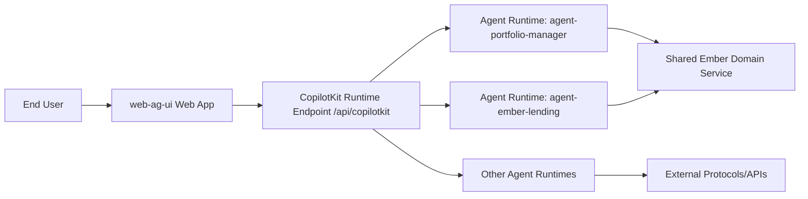
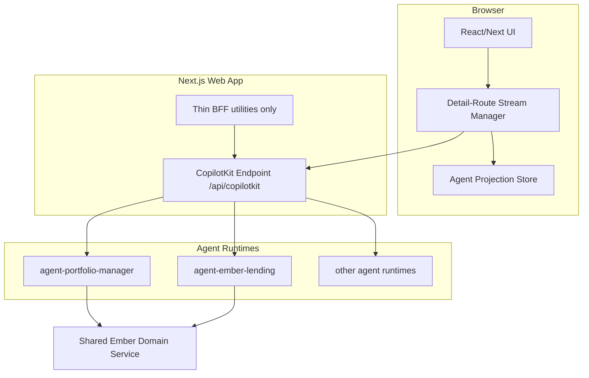
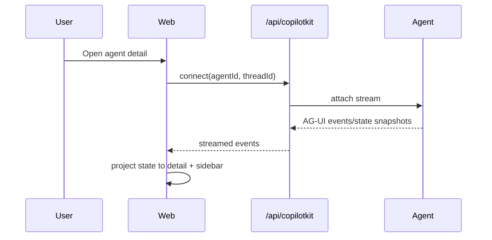
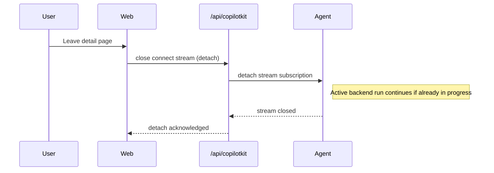
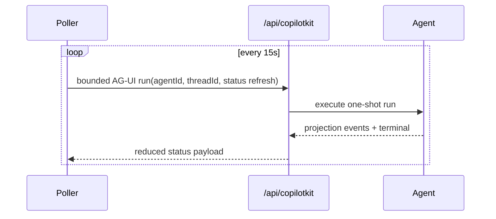
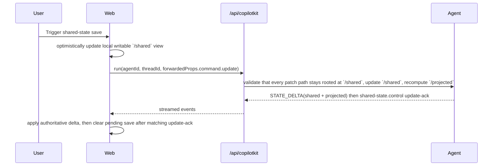

# C4 Target Architecture: web-ag-ui + Agents (AG-UI-Only)

Status: Draft (target vision)
Scope: `typescript/clients/web-ag-ui/apps/web` and `typescript/clients/web-ag-ui/apps/agent*`

See also:

- `docs/c4-pi-runtime-architecture-and-boundaries.md` for the Pi-backed runtime specialization of this target architecture
- `docs/ag-ui-client-runtime-invariants.md`
- `docs/ag-ui-frontend-backend-contract-ui-stability.md`
- `docs/source-traced-portfolio-manager-ember-lending-sequence.mdd`
- `docs/target-state-portfolio-manager-ember-lending-sequence.mdd`

## 1. Why this document exists

This C4 document describes the target architecture we want to converge to from the current implementation:

- Web must communicate with agents through AG-UI `connect`/`run` flows via CopilotKit runtime, with `stop` used only for `fire` preemption.
- Web must not read or mutate LangGraph thread state directly (`/threads/*`).
- Agent state lifecycle and onboarding/task transitions should be consistent across all agent apps.

Current code references that motivate this:

- `apps/web/src/hooks/useAgentConnection.ts` (active-detail stream + AG-UI command bus)
- `apps/web/src/contexts/AgentListContext.tsx` (sidebar polling cadence and fan-out behavior)
- `apps/agent-workflow-core/src/taskLifecycle.ts` (shared command and task lifecycle helpers)
- `patches/@ag-ui__langgraph@0.0.20.patch` (custom connect behavior)

## 2. Architectural principles (target)

1. AG-UI is the only web-to-agent protocol boundary.
2. One long-lived `connect` stream only while an agent detail page is active; no hidden background persistent streams.
3. List/status updates are bounded polling and protocol-compliant.
4. All agents publish one versioned `ThreadState` contract.
5. Agent command and task transitions are governed by a shared state machine library, not per-agent drift.
6. One authority gate and shared projection reducer are the source of truth for UI state across `connect`/`run`/poll ingress.

## 3. C4 Level 1: System Context

```mermaid
flowchart LR
  U[End User] --> W[web-ag-ui Web App]
  W --> R[CopilotKit Runtime Endpoint /api/copilotkit]
  R --> PM[Agent Runtime: agent-portfolio-manager]
  R --> EL[Agent Runtime: agent-ember-lending]
  R --> O[Other Agent Runtimes]

  PM --> SE[Shared Ember Domain Service]
  EL --> SE
  O --> X[External Protocols/APIs]
```

Boundary intent:

- User-facing web talks only to CopilotKit runtime over AG-UI-compatible routes.
- Runtime talks to agent runtimes; web never talks directly to LangGraph thread APIs.
- The first concrete managed-runtime pair is `agent-portfolio-manager` plus `agent-ember-lending`; they stay as separate runtimes and meet only through the Shared Ember boundary rather than direct runtime-to-runtime calls.

## 4. C4 Level 2: Container View

```mermaid
flowchart TB
  subgraph Browser[Browser]
    UI[React/Next UI]
    Store[Agent Projection Store]
    StreamMgr[Detail-Route Stream Manager]
  end

  subgraph WebServer[Next.js Web App]
    CK[CopilotKit Endpoint /api/copilotkit]
    BFF[Thin BFF utilities only]
  end

  subgraph AgentRuntimes[Agent Runtimes]
    PM[agent-portfolio-manager]
    EL[agent-ember-lending]
    OTHER[other agent runtimes]
  end

  SE[Shared Ember Domain Service]

  UI --> StreamMgr
  StreamMgr --> Store
  StreamMgr --> CK
  BFF --> CK
  CK --> PM
  CK --> EL
  CK --> OTHER
  PM --> SE
  EL --> SE
```

Container responsibilities:

- UI: rendering only; no LangGraph thread semantics.
- Stream Manager: owns connect/run lifecycle, stream detach, and detail-route activity rules.
- Projection Store: derives sidebar/detail state from AG-UI events.
- CopilotKit endpoint: protocol boundary and routing to agents.
- Agent runtimes: workflow execution and state emission.
- Managed downstream note: `agent-portfolio-manager` owns managed onboarding/control-plane flows, while `agent-ember-lending` stays on the bounded subagent read/plan/execute/escalate surface against Shared Ember.
  - Shared Ember, not the portfolio-manager runtime, owns the durable wallet observation, managed-lane owned units, reservations, and policy snapshots produced during onboarding completion.
  - Portfolio-manager wallet/accounting context must read `orchestrator.readOnboardingState.v1` through the activated managed mandate lane so the operator sees the same `lending.supply` reservation and policy state that Ember Lending consumes.
  - During migration, portfolio-manager keeps a read-side fallback for older stored bootstrap payloads that only recorded `activation.agentId`; current writes still use `activation.mandateRef`.

Explicit non-goal container:

- No `/api/agents/sync` container in target architecture.

## 5. C4 Level 3: Component View

### 5.1 Web components

- `AgentStreamCoordinator` (new):
  - Ensures only the currently active detail-page agent keeps a long-lived `connect` stream.
  - On route change away from detail page/unmount, detaches stream ownership immediately (without stopping backend runs).
  - Enforces a hard cap of active streams (target: `<= 1` long-lived detail stream).

- `AgentStatusPoller` (refactored list polling):
  - Every 15s, performs one-shot AG-UI `run` status sync for agents whose detail page is not currently active.
  - Poll runs are bounded lifecycle invocations (`run` start -> snapshot/events -> terminal), not persistent `connect` loops.
  - Poll intent stays on `forwardedProps.command` for route tracing and runtime observability instead of synthetic JSON user messages.
  - Uses protocol-compliant calls only; no direct thread endpoints.
  - Writes normalized status to shared projection store.

- `AgentProjectionReducer`:
  - Target: shared projection contract from AG-UI events and `ThreadState` snapshots to `UiState` for both sidebar and detail.
  - Supports multiple ingress channels (`connect`, `run`, polling) with single-owner authority per agent.
  - Active detail-page agent is owned by `connect`; non-active-detail agents are owned by polling snapshots.
  - Applies source-ownership checks and drops non-owner updates.
  - Optional hardening: ownership epoch checks for stale update suppression.
  - Removes split-brain between stream state and sync endpoint state.

- `AgentCommandBus`:
  - Sends named commands such as `hire`/`fire`, interrupt responses, and shared-state `command.update` intents via AG-UI `run` payloads.
  - `fire` may invoke AG-UI `stop` as a pre-dispatch preemption control.
  - No out-of-band command mutation.

- `AgentCommandScheduler` (new):
  - Enforces command concurrency policy by `agentId+threadId`.
  - `fire` is preemptive for backend and local ownership (`stop` then detach, wait terminal/timeout, then dispatch).
  - Shared-state `command.update` uses coalescing intent policy (single pending intent, last-write-wins).
  - Normalizes server busy responses into deterministic observe/retry behavior.

- `AgentMetricsRendererRegistry` (new):
  - Resolves a per-agent metrics renderer by `agentId` (e.g., CLMM, GMX Allora, Pendle).
  - Keeps shared frame chrome (tabs/cards/loading/error) in one place.
  - Moves agent-specific metric visuals and derived calculations into isolated components.
  - Prevents a single “god” detail component from owning all agent-specific branches.
  - Remaining detail decomposition: blocker/setup form branching is partially extracted; `AgentDetailPage` still holds non-trivial agent-specific orchestration.

### 5.2 Runtime/server components

- `CopilotKit Runtime Route` (`/api/copilotkit`):
  - The only server route used by web for agent communication.
  - Exposes AG-UI `connect`, `run`, and `stop` semantics used by web.
  - Request metadata and debug traces should read command intent from `forwardedProps.command` and related control-lane fields, not by parsing the last chat message.
  - Structured interrupt-resume tracing should log full serialized `resumePayloadLength` separately from the truncated `resumePayloadPreview`.
  - For standalone Pi-backed agents, imports runtime-owned transport helpers rather than defining Pi-specific transport behavior locally.

- `Agent Registry`:
  - Maps agent ids to runtime endpoints and capabilities.
  - Provides metadata only; does not mirror thread state.
  - Must support multiple runtime families cleanly, including standalone Pi gateway-backed agents registered through `HttpAgent` rather than in-process runtime embedding.
  - Must register managed-runtime pairs cleanly, such as `agent-portfolio-manager` and `agent-ember-lending`, without collapsing them into one combined runtime identity.

- Pi-backed runtime package ownership:
  - The `agent-runtime` package family owns the reusable Pi AG-UI HTTP adapter/server layer.
  - The `agent-runtime` package family also owns the Pi-capable `HttpAgent` implementation used by `apps/web` to consume that AG-UI surface.
  - Concrete Pi-backed agent apps should mostly provide domain/runtime assembly and app-specific bootstrap, not reimplement generic AG-UI transport glue.

### 5.3 Agent runtime components (shared pattern)

Each `apps/agent*` uses a standard graph shape:

- Command ingestion node (`runCommand`)
- Onboarding/bootstrapping nodes
- Cycle/poll nodes
- Summary/terminal node
- `ThreadState` + `task` projection emission

Target factorization:

- `@web-ag-ui/agent-workflow-core` (new shared internal package):
  - Canonical command parsing
  - Canonical onboarding + task state machine
  - Shared `ThreadState` schema + versioning
  - Shared event/status helpers

Current concrete managed-path specialization:

- `agent-portfolio-manager`
  - owns onboarding approval, rooted-signing collection, and managed-agent activation/deactivation intent submission
  - resolves the configured direct OWS controller wallet during startup and confirms or rewrites the durable `portfolio-manager` / `orchestrator` identity before boot
  - treats each distinct startup identity rewrite as a new command with its own identity-scoped idempotency key and fails closed unless Shared Ember echoes the confirmed identity with the expected `agent_id`, `role`, and wallet address
  - only marks onboarding complete after rooted bootstrap once a follow-up `subagent.readExecutionContext.v1` read for `ember-lending` exposes a non-null `subagent_wallet_address`
  - submits the minimal rooted-bootstrap activation contract that tells Shared Ember which managed mandate should materialize the initial lane
  - consumes Shared Ember through a thin app-local adapter without owning Ember business logic

- `agent-ember-lending`
  - owns the first bounded managed-subagent runtime
  - resolves the configured direct OWS signer wallet during startup and confirms or rewrites the durable `ember-lending` / `subagent` identity before boot
  - treats each distinct startup identity rewrite as a new command with its own identity-scoped idempotency key and fails closed unless Shared Ember echoes the confirmed identity with the expected `agent_id`, `role`, and wallet address
  - consumes runtime-internal Shared Ember projection and execution-context reads plus the model-visible `create_transaction_plan`, `request_transaction_execution`, and `create_escalation_request` contract
  - keeps planning on the bounded Shared Ember planner contract, sending only a bounded planning handoff while receiving planner-generated payload output back in the candidate plan
  - treats candidate-plan creation as complete only after the lending service has privately anchored that planner-returned payload; missing planner metadata, missing managed wallet context, or missing anchored-resolver wiring must fail closed instead of leaving an apparently executable local plan
  - keeps `request_transaction_execution` as one model-visible tool while
    internally composing Shared Ember execution preparation, service-owned
    anchored Onchain Actions ordered transaction-request persistence and step
    resolution in runtime-owned domain state, local OWS signing custody, shared
    runtime / adapter support for redelegation and delegated-execution
    preparation, and Ember-owned submission/finalization
  - treats `authority_preparation_needed` as an internal wait state and re-polls the Shared Ember execution request with a stage-scoped retry idempotency key instead of exposing a second tool or reusing the original acknowledged request key
  - reconciles dropped signed-transaction submit responses through the Shared Ember committed-event outbox before replaying an idempotent submit
  - fails closed when the direct OWS identity/signing path cannot prove it matches the prepared dedicated subagent signing package
  - expects the first healthy post-onboarding `subagent.readExecutionContext.v1` read to expose a non-null `subagent_wallet_address` without any manual reseed step
  - projects lifecycle, wallet, mandate, reservation, planning, execution, and escalation state into the shared AG-UI thread contract
  - treats `owned_units` and `reservations` as lending-lane truth while treating `wallet_contents` as rooted-wallet-wide context for prompt visibility

Managed-path direction note:

- signing custody remains local to each agent runtime
- the leaf account topology remains open so current direct-OWS / EOA-style
  leaves and future smart-account leaves can both fit behind the same shared
  execution contract
- agent apps should not be the steady-state owners of low-level redelegation
  wrapper assembly, signature normalization, or submission-artifact
  serialization

Validation note:

- `pnpm smoke:managed-identities` is the current repo-local proof for the two non-null identity reads plus the non-null post-bootstrap `subagent_wallet_address`.
- That smoke stays on the current downstream runtime-owned direct OWS path; deeper OWS-internals changes are intentionally handled elsewhere.
- `RUN_SHARED_EMBER_INT=1 EMBER_ORCHESTRATION_V1_SPEC_ROOT=<private-repo-root> pnpm --filter agent-ember-lending test:int -- src/sharedEmberAdapter.int.test.ts`
  is the repo-backed proof for the real runtime-owned redelegation typed-data
  signing seam.

## 6. Dynamic views (sequence)

### 6.1 Detail page open (active stream)

```mermaid
sequenceDiagram
  participant User
  participant Web
  participant Runtime as /api/copilotkit
  participant Agent

  User->>Web: Open agent detail
  Web->>Runtime: connect(agentId, threadId)
  Runtime->>Agent: attach stream
  Agent-->>Runtime: AG-UI events/state snapshots
  Runtime-->>Web: streamed events
  Web->>Web: project state to detail + sidebar
```

### 6.2 Navigate away from detail

```mermaid
sequenceDiagram
  participant User
  participant Web
  participant Runtime as /api/copilotkit
  participant Agent

  User->>Web: Leave detail page
  Web->>Runtime: close connect stream (detach)
  Runtime->>Agent: detach stream subscription
  Note right of Agent: Active backend run continues if already in progress
  Agent-->>Runtime: stream closed
  Runtime-->>Web: detach acknowledged
```

### 6.3 Sidebar refresh (non-active-detail agents)

```mermaid
sequenceDiagram
  participant Poller
  participant Runtime as /api/copilotkit
  participant Agent

  loop every 15s
    Poller->>Runtime: bounded AG-UI run(agentId, threadId, status refresh)
    Runtime->>Agent: execute one-shot run
    Agent-->>Runtime: projection events + terminal
    Runtime-->>Poller: reduced status payload
  end
```

### 6.4 Client state mutation through run

```mermaid
sequenceDiagram
  participant User
  participant Web
  participant Runtime as /api/copilotkit
  participant Agent

  User->>Web: Trigger shared-state save
  Web->>Web: optimistically update local writable `/shared` view
  Web->>Runtime: run(agentId, threadId, forwardedProps.command.update)
  Runtime->>Agent: validate that every patch path stays rooted at `/shared`, update `/shared`, recompute `/projected`
  Agent-->>Runtime: STATE_DELTA(shared + projected) then shared-state.control update-ack
  Runtime-->>Web: streamed events
  Web->>Web: apply authoritative delta, then clear pending save after matching update-ack
```

- Malformed Pi `command.update` requests that omit `clientMutationId` are rejected at the runtime boundary before `shared-state.control` `update-ack`, because `clientMutationId` is the acknowledgment correlation key.

## 7. Data contracts

### 7.1 Canonical contracts (target)

- `ThreadState@vN` (versioned, domain-facing): profile, metrics, activity, task, interrupts, onboarding.
- `UiState` (web VM-facing): deterministic projection from AG-UI events + `ThreadState` snapshots.
- `TaskState` enum (shared): `submitted`, `working`, `input-required`, `completed`, `failed`, `canceled`.
- Named control-plane commands stay explicit (`hire`, `fire`, typed interrupt resolutions); shared-state writes use `command.update` against the writable public-state slice rooted at `/shared`.
- In v1, `/shared` versus `/projected` is the editability model: `/shared` is writable, while `/projected` remains runtime-owned and non-patchable.
- Typed interrupt resolutions may carry structured `command.resume` payload objects across the direct command lane without pre-stringifying them in the web client.

### 7.2 Rules

- Backing thread state is internal to agent runtime.
- UI projections are derived from AG-UI events, not direct thread reads.
- Client-to-agent state mutation uses AG-UI `run` input (`state`/`messages`), not `connect`.
- `connect` is attach/replay for projection continuity, not a write path.
- `AgentCommand` is transport/control-plane intent and must not be persisted as a render-driving field in shared `ThreadState`/`UiState`.
- Unknown contract version must fail safe with explicit telemetry.

## 8. Operational invariants

1. Long-lived detail streams: maximum 1 per web client runtime instance (for example, per browser tab) while an agent detail page is active.
2. Sidebar polling cadence: default 15s, bounded concurrency.
3. Sidebar polling execution path: one-shot AG-UI `run` only; polling must not use persistent `connect`.
4. No direct web calls to `/threads`, `/runs`, or `/state`.
5. Client-to-agent state mutation is written through AG-UI `run` input; `connect` is attach/replay only.
6. Per-agent authority is single-owner at a time:
   - active detail-page agent -> `connect`,
   - non-active-detail agents -> polling snapshots projected from one-shot poll `run`,
   - fallback without either -> active `run` stream for that command lifecycle.
7. Local run-in-flight gating is advisory; server busy responses are authoritative for global concurrency.
8. Shared-state `command.update` uses coalescing intent semantics (single pending intent per `agentId+threadId`, last-write-wins).
9. `fire` is the only preemptive stop command: issue `stop`, detach local stream, wait terminal/timeout, then dispatch `fire`.
10. Terminal run handling is idempotent: client converges on one terminal outcome even if terminal callbacks are duplicated.
11. On detail-page route leave/unmount, stream teardown is deterministic.
12. Invariant details and implementation guidance are specified in `docs/ag-ui-client-runtime-invariants.md`.

## 9. Migration plan (from current state)

### Slice 1: Protocol boundary cleanup

- Remove `apps/web/src/app/api/agents/sync/route.ts` and consumers.
- Replace `useAgentConnection` mutation fallback with AG-UI-only direct-command projection path.
- Keep behavior parity via tests before deletion.

### Slice 2: Detail-route stream governance

- Introduce `AgentStreamCoordinator`.
- Enforce stream ownership and deterministic stream detach on navigation.
- Add instrumentation for active stream count.

### Slice 3: Sidebar projection refactor

- Replace `AgentListContext` direct sync with bounded AG-UI one-shot `run` status polling.
- Share reducer/state model between sidebar and detail.

### Slice 4: Metrics UI decomposition

- Introduce `AgentMetricsRendererRegistry` and per-agent metrics components.
- Keep `AgentDetailPage` as composition shell only (routing/layout), not a multi-agent logic hub.
- Move per-agent metric transforms into typed selectors adjacent to each renderer.

### Slice 5: Agent shared kernel

- Extract shared command/state/task logic from `apps/agent*` into internal package.
- Align all agents to one task lifecycle and onboarding contract.

### Slice 6: Patch retirement

- Minimize and retire local patches where upstream behavior is sufficient.
- Keep only patches that are protocol-correct and covered by tests.
- Exception: keep `@ag-ui/langgraph` connect patch until upstream ships equivalent `connect` semantics
  for thread attachment/resume in stable releases.
- Evidence note (as of February 18, 2026): `@ag-ui/langgraph@0.0.24` (latest stable) and
  `@ag-ui/langgraph@0.0.25-alpha.0` do not expose `connect` on `LangGraphAgent` in `dist/index.d.ts`.
- Exit criteria for this exception:
  - Upstream package exposes `connect` on `LangGraphAgent` (types and runtime),
  - Behavior parity is validated against detail-page open/leave and sidebar sync scenarios,
  - Local patch can be removed without regressing stream lifecycle correctness.

## 10. Success criteria for target architecture

- Web has zero direct LangGraph thread API calls.
- AG-UI events are the only source for UI state sync.
- Hidden persistent streams are eliminated.
- Agent apps share one state-machine contract and lifecycle rules.
- Sidebar and detail are consistent under load and navigation churn.

## 11. Convergence status (2026-02-18)

Completed:

- `/api/agents/sync` is removed.
- `/api/agents/abort-active-run` is removed.
- Web no longer calls LangGraph `/threads`/`/runs` endpoints directly.
- Detail connection ownership is enforced via `AgentStreamCoordinator`.
- Sidebar polling now enforces explicit bounded concurrency (`NEXT_PUBLIC_AGENT_LIST_SYNC_MAX_CONCURRENT`) and uses one-shot AG-UI `run` polling (no persistent poll `connect` loop).
- Shared `TaskState`/`AgentCommand` vocabulary is exported from `agent-workflow-core` and adopted by `apps/agent*` workflow contexts.
- Shared lifecycle reducers now live in `agent-workflow-core` and are adopted across `apps/agent*`:
  - `resolveSummaryTaskStatus` (summary terminal-state policy),
  - `resolveRunCommandForView` + `resolveCommandTargetForBootstrappedFlow` (baseline command routing policy).
- Shared onboarding phase state-machine now lives in `agent-workflow-core` and is adopted across agent onboarding routing paths:
  - `resolveOnboardingPhase` + `mapOnboardingPhaseToTarget`,
  - consumed by CLMM/GMX onboarding routing and Pendle cycle command routing.
- Agent setup-step branching logic is extracted from `AgentDetailPage` into `apps/web/src/components/agentSetupSteps.ts`.
- Non-metrics blockers/onboarding branch helpers are extracted from `AgentDetailPage` into specialized modules:
  - `apps/web/src/components/agentBlockersBehavior.ts`,
  - `apps/web/src/components/agentBlockersInterrupt.ts`.
- Web command scheduling now uses a dedicated `AgentCommandScheduler` (`apps/web/src/utils/agentCommandScheduler.ts`) with bounded busy-retry handling for coalesced shared-state writes.
- Integration coverage now verifies key lifecycle invariants:
  - `apps/web/src/contexts/AgentListContext.int.test.tsx` asserts bounded non-active-detail polling fan-out and periodic no-overlap behavior.
- `apps/web/src/hooks/useAgentConnection.int.test.tsx` asserts detail-page connect and deterministic detach on unmount.
- `apps/web/src/utils/agentCommandScheduler.unit.test.ts` asserts coalescing, terminal replay, bounded busy retries, and non-update in-flight rejection.
- `apps/web/src/hooks/useAgentConnection.int.test.tsx` asserts authoritative Pi `STATE_DELTA` hydration, `shared-state.control` confirmation, rejected-ack reconciliation, and rollback on local Pi dispatch failures for optimistic shared-state writes.
- `apps/web/src/app/api/copilotkit/piRuntimeHttpAgent.int.test.ts` and `agent-runtime/src/index.int.test.ts` assert object `command.resume` payload passthrough across the web, transport, and Pi runtime layers.

Remaining gaps:

- Detail/sidebar are not yet unified under one concrete reducer artifact; detail still consumes richer state directly.
- `AgentDetailPage` is not yet a pure shell; additional blocker/setup orchestration extraction is still pending.
